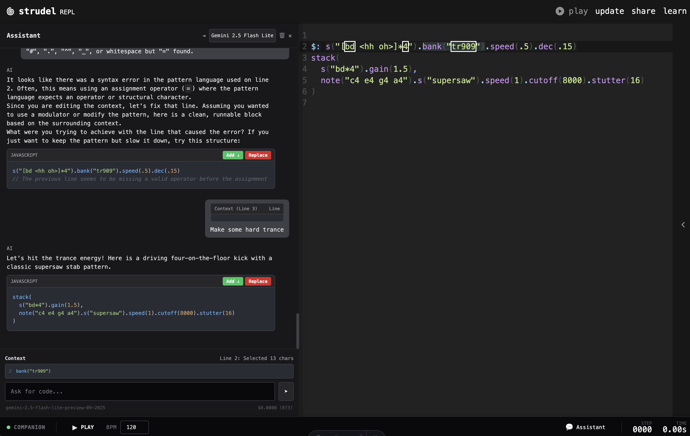

# LiveVibe

**LiveVibe** is a live-coding music environment built on top of [Strudel](https://strudel.cc/), the JavaScript port of TidalCycles. It adds a Companion app, an AI-powered Assistant, and extension hooks for building creative tools.



## Features

- 🎵 **Strudel REPL** — Embedded live-coding environment for pattern-based music
- 🤖 **AI Assistant** — Inline help for writing Strudel patterns (Gemini-powered)
- 🔌 **Extension Host** — Hook into the REPL for custom panels and controls
- 🖥️ **Companion App** — Standalone transport & sync server

## Quick Start

```bash
# Clone with submodules
git clone --recurse-submodules https://github.com/your-org/livevibe.git
cd livevibe

# Install dependencies
pnpm install

# Start dev environment (Companion + Web + Strudel)
pnpm dev
```

This runs three services concurrently:
- **Companion** — Transport server on `localhost:4567`
- **Web** — Next.js launcher on `localhost:3000`
- **Strudel** — Astro REPL on `localhost:4321`

## Project Structure

```
livevibe/
├── apps/
│   ├── companion/       # Standalone transport & LLM server
│   └── web/             # Next.js launcher app
├── packages/
│   ├── protocol/        # Shared WebSocket message types
│   ├── llm/             # LLM provider abstraction & prompt harness
│   └── strudel-extensions/  # React components injected into Strudel
├── vendor/
│   └── strudel/         # Strudel submodule (patched)
├── patches/
│   └── strudel/         # Integration patches for Strudel
└── scripts/
    └── setup-strudel.sh # Auto-apply patches on install
```

## Scripts

| Command           | Description                                    |
| ----------------- | ---------------------------------------------- |
| `pnpm dev`        | Run all services (Companion, Web, Strudel)     |
| `pnpm dev:strudel`| Run Strudel REPL only                          |
| `pnpm build`      | Build the Next.js web app                      |
| `pnpm patch:save` | Save current Strudel modifications to patch    |

## Assistant

The embedded Assistant helps you write Strudel patterns. It knows valid Strudel functions, synth waveforms, and effects. Select code in the editor for context-aware suggestions.

**Supported Models:**
- Gemini 2.5 Flash
- Gemini 2.5 Flash Lite
- Gemini 3 Flash (Preview)

## License

MIT
